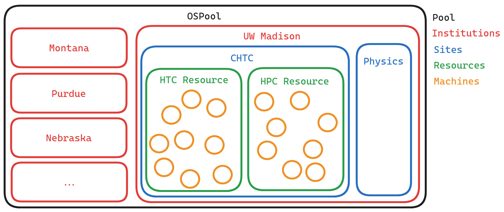

# OSPool Hierarchy

## Background

The OSPool (Open Science Pool) is a collection of high throughput 
computing resources from over 60 institutions around the world.
It is dynamic and heterogeneous, so the state of the OSPool might
change from moment to moment randomly, and without warning.
The first step when creating the Pool Exerciser infrastructure was
to determine what the various layers of the OSPool are, where that
information is stored, and how to gather it. After exploring these
questions, we created the following diagram, which describes the 
layers of the OSPool within the context of the Pool Exerciser project.

## Diagram

## Key

Pool: Top layer of the OSPool. A collection of institutions which provide 
resources to the OSPool.

Institution: A college/university/campus/etc. which donates some portion 
of their computing resources to be used by the OSPool. Composed of one or
more sites.

Site: A collection of resources as defined by the institution that it
belongs to. Composed of one or more resources.

Resource: A collection of machines/execution points as defined by the
institution that it belongs to. Composed of one or more machines.

Machine: The machine, or execution point, is where jobs actually run.
 Contains computing resources such as cpus, gpus, memory, disk, etc.

## Purpose

*Why is it important to understand the OSPool hierarchy?*

The goal of the Pool Exerciser is to identify the location of problems in
the OSPool by sending out specific tests to targeted locations in the Pool.
To do this, we first needed to understand how the OSPool is organized, so we can 
accurately sample it. After constructing the diagram, we decided to target
the **Resource** level of the OSPool. This means we query the Central Manager
Collector for a list of all the unique Resources which currently exist in
the OSPool. Then we send a sample of tests to each Resource. By doing this,
we are able to locate problems, and determine on what layer the issue is
occuring.