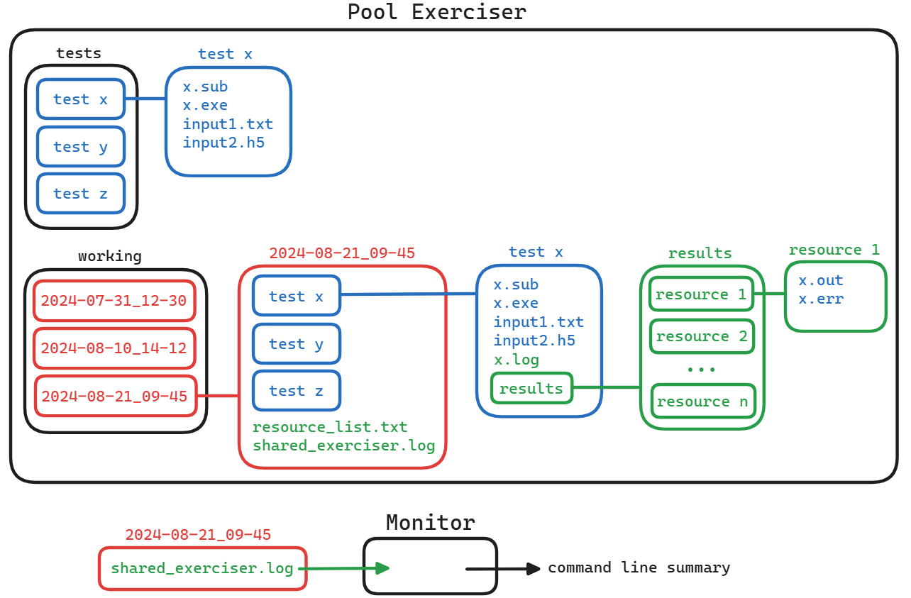

# Under The Hood

## Normal Execution

When run with no command line options, the Pool Exerciser first creates an execution directory
under the **working** directory. This execution directory is named by the time the Exerciser was
run. Because of this, the Exerciser can only be run once a minute, to allow for unique directory
names. The Exerciser then queries the Central Manager Collector for a list of the current resources
in the OSPool, and constructs a resource list. 
The Exerciser then iterates through the **tests** directory, and copies each test into the
new timestamped execution directory. As it does this, it checks to make sure each test has exactly
one .sub file. After that, it parses the .sub file into an htcondor2 submit object. It then adds a
requriement to ensure the job lands on the target resource. It also adds a periodic remove statement
to keep the job from becoming stuck and wasting resources. Finally it adds attributes to identify
the job as an Exerciser job, and to report to a shared log for the exercsier run. Finally, it
submits the test to the OSPool, with one job being sent to each resource in the resource list.
The jobs then run on their target resource, and output is returned to be interpreted by the monitor
tool.

## Diagram

## Abnormal Execution

With the selection of certain command line options, the execution of the Exerciser may differ. 

Selecting the -w or -t options will speccify a different **working** or **tests** dir respectively.
This means that if you use -w, the execution directory will be created under the provided dir, and
if you use -t, the exerciser will only submit tests found in that dir.

Selecting -p will cause the Exerciser to print all available tests, and then exit without running
anything.

Likewise, -s will cause the Exerciser to print all the current resources in the OSPool without
running any tests. The -p and -s options cannot be run simultaneously

Selecting -b will prevent the Exerciser from running, but it will still run any other option. This
can be useful to select with -f, if you want to clear the **working** dir without submitting any
more tests.
